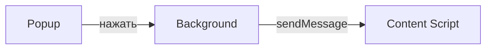
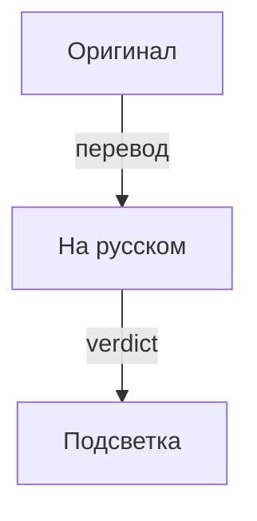

# Дизайн браузерного расширения FactCheck AI

Простой макет интерфейса для MVP.

## Popup

- Заголовок с логотипом FactCheck AI
- Кнопка **«Проверить страницу»**
- Кнопка **«Настройки»** (позже)
- Минимальная ширина: 300 px

## Боковая панель

Использует React и Shadow DOM.

- **Две колонки**: слева оригинал утверждения, справа перевод на русский.
- Цветовая подсветка строки: 
  - зелёный — support
  - красный — refute
  - жёлтый — not_enough
- Внизу каждой строки кнопка «Подробнее» с раскрытием доказательств (URL + title).

## Иконки

- icon16.png, icon48.png, icon128.png — вариант совы со значком лупы.

## Цветовая схема

- Основной фон: `#ffffff`
- Зелёный: `#d1fae5`
- Красный: `#fee2e2`
- Жёлтый: `#fef9c3`

